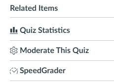
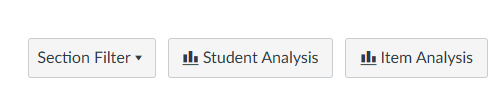

# Canvas Quiz Download Converter

Quick website to convert a CSV of student responses to a Canvas quiz into a format that's easier to assign grades from. 

> [!NOTE]
> This is a pretty niche script and may not be much use if you're not using Canvas to give your students take home quizzes where they have to do multiple repetitions out of a giant bank of questions. It's mostly here to make it easier for us to convert the CSV files than using the Python script we're using right now.

## Quiz Setup

This assumes that the quiz is setup in a specific way. 

* Old quiz. This currently doesn't work with the "new" quizzes format, even though that format is almost 10 years. It's still easier to work with the old style for this.
* Multiple attempts. 
* Pulling from a large bank. When we've used this it's generally pulling 5 questions out of a bank with almost 2,000 questions. 

## Usage

In Canvas, open the quiz and click on the "Quiz Statistics" button.

Click on the "Student Analysis" button on the page that comes up. Download the CSV file somewhere so you can get to it in a few steps. 

